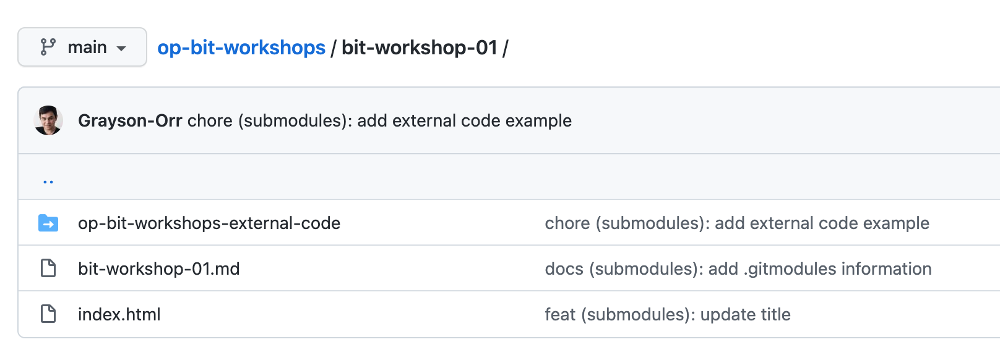

# BIT Workshop 01

## Agenda

- Git commit message naming conventions
- Git submodules
- GitHub Campus Expert program

### Git commit message naming conventions

You have written many commit messages thus far in your **BIT** degree. However, based on my observations, you could format your messages more concisely, and it only takes a little bit of care. We will discuss a message convention (not a standard) heavily adopted in the industry.

A message is broken down into four components - type, scope (optional), subject, extended description (optional) & footer (optional).

List of types:
* build: build related change, i.e., installing application dependencies.
* chore: change that an end-user will not see, i.e., configuring files for but not limited to code formatting, code linting & version control.
* feat: a new feature or piece of functionality that an end-user will see, i.e., a register or login page.
* fix: a bug fix, i.e. an issue with the register or login page.
* docs: documentation related change, i.e., changing **README.md** file.
* refactor: something that is neither a feat nor fix, i.e., a semantic code change.
* style: style-related change, i.e., formatting a file or piece of code.
* test: an automation test change, i.e., adding a new test file or updating an existing test file.

What is a scope? A noun referring to functionality in your codebase, i.e., authentication. 

Familiarise yourself with this convention, particularly if you are currently enrolled in my courses. However, if you are not, then it is something you should consider adding to your existing **Git** skills & knowledge.

You are probably wondering, how do I write a message using this convention. A **Git** commit looks like this:

```bash
git commit -m "<type> (optional scope): <subject>" -m "<optional extended description>" -m "<optional footer>"
```

Let us see this in action!

Here is a **Git** commit example:

```bash
git commit -m "style (login): format jsx"
```

Here is a **Git** commit example with an extended description & footer:

```bash
git commit -m "style (login): format jsx" -m "additional information" -m "PR Close #12345"
```

When should I use an extended description? When a message is greater than 50 characters. **Note:** This convention is recommended by **GitHub**. However, this can vary from company to company.

What happens if I want view a commit with a specific type? 

```bash
git log --oneline --grep <type>
```

- --oneline - Display the output as one commit per line

Here is a **Git**  log example:

```bash
git log --oneline --grep feat
```

Here is a **Git**  example with multiple types:
 
```bash
git log --oneline --grep "^build\|^feat\|^style"
```

**Resource:** <https://git-scm.com/docs/git-log>

### Git submodules

You probably have encountered the following:



What is happening? You have a repository with a repository.

**Git submodules** refer to a specified **Git** repository at a particular snapshot, i.e., commit in time. Also, **submodules** enable a host **Git** repository to track the commit history of the specified repository.

Our applications often depend on external code. The code can be implemented in various ways, i.e., copying & pasting into a host **Git** repository or using a package manager, i.e., **Gems**, **NPM** or **Pip**. Both of these approaches have downsides, such as a loss of upstream changes to the specified repository & version management.

**Submodules** do not track **Git** refs & branches. Also, **submodules** do not automatically update when a host **Git** repository is updated.

**Resources:**
- Ref - https://git-scm.com/book/en/v2/Git-Internals-Git-References
- Branch - https://git-scm.com/book/en/v2/Git-Branching-Basic-Branching-and-Merging

When should I use **Git submodules**? When you need to maintain a strict version management of your external code's dependencies.

Let us see this in action!

```bash
cd bit-workshop-01
git submodule add https://github.com/Grayson-Orr/op-bit-workshops-external-code
git status
```

What is happening? 
- Change directory to `bit-workshop-01`.
- When the command `git submodule add <url>` is run, **Git** will clone the specified repository as a **submodule**. 
- View the current state of the host **Git** repository.

You will notice a `.gitmodules` file & `op-bit-workshops-external-code` directory have been created. View the `.gitmodules` file. You see the following:

```md
[submodule "bit-workshop-01/op-bit-workshops-external-code"]
	path = bit-workshop-01/op-bit-workshops-external-code
	url = https://github.com/Grayson-Orr/op-bit-workshops-external-code
```

Here are some other useful `git submodule` options:
- Initialise a git submodule - `cd` to the submodule directory, `git submodule init` & `git submodule update --remote`
- Update a git submodule (in the submodule directory) - `git submodule update --remote`
- Update all git submodules (in the root directory) - `git submodule update --remote`
- Remove git submodule - `git rm --cached <submodule name>`, delete the submodule from the `.gitmodules` file, `git submodule deinit <submodule name>`
- Clone repository with git submodules - `git clone --recursive <https url to repository>`

**Resources:** 
- <https://git-scm.com/book/en/v2/Git-Tools-Submodules>
- <https://git-scm.com/docs/git-submodule>

### GitHub Campus Expert program

**GH Campus Experts** are learner leaders who have the drive to lead a tech community on their campus. They strive to build a safe, diverse & inclusive space for learners to learn. **GH Campus Experts** work closely with their fellow learners to help create opportunities to learn industry-relevant knowledge & skills.

If you become a **GH Campus Expert**, you will get support & training from **GitHub** & build a network with other **GH Campus Experts** around the world.

For more information, please view the resource below.

**Resource:** <https://education.github.com/experts>
